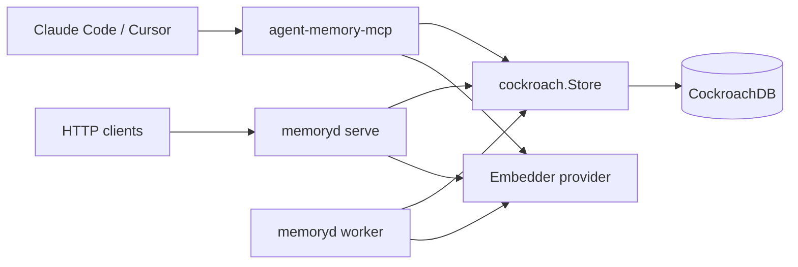
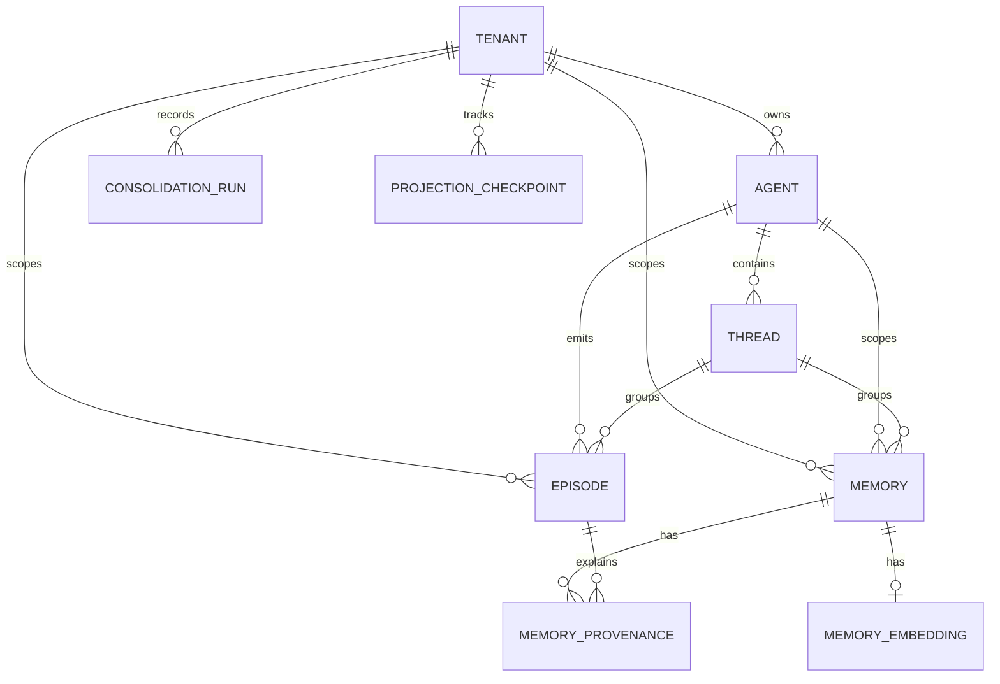
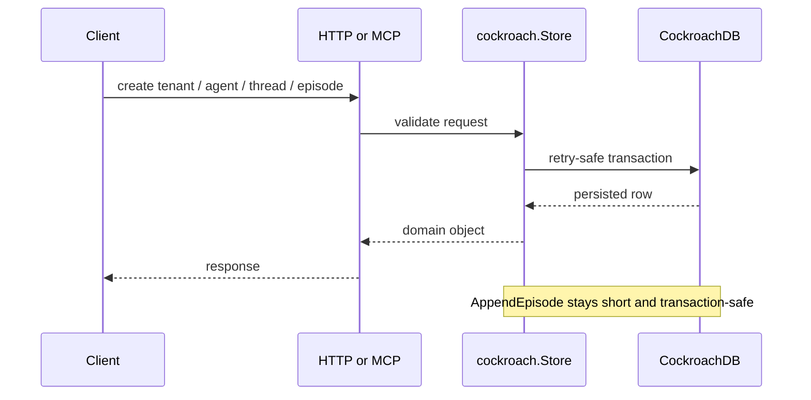
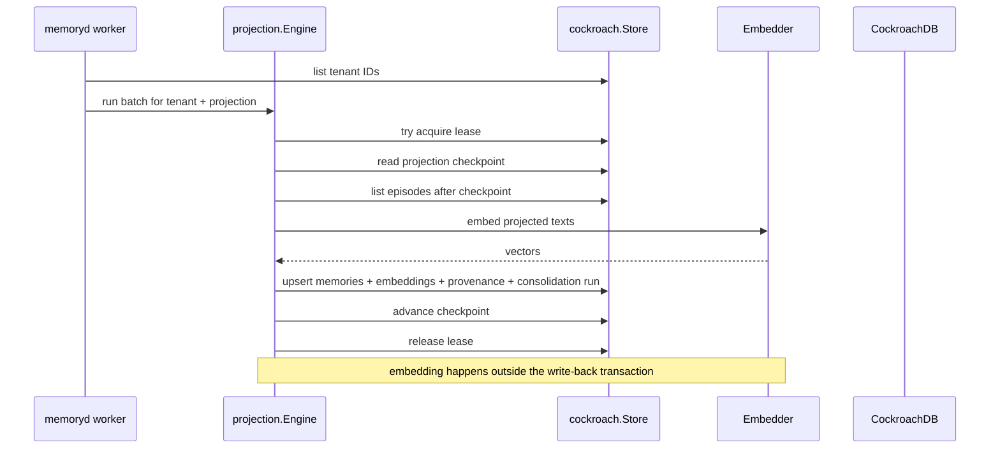
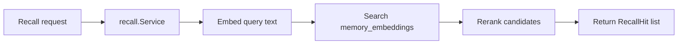

# Architecture

`agent-memory` is a CockroachDB-first memory system for AI agents. The core idea is simple:

1. record raw agent activity as immutable `episodes`
2. turn those episodes into durable derived `memories`
3. recall those memories through filtered and semantic search

The codebase is intentionally split so the write path stays short and retry-safe, while heavier work like embedding and memory consolidation happens asynchronously.

## System Overview

There are two runtime entry points today:

- `memoryd`
  - HTTP API
  - health and metrics endpoints
  - migration and doctor commands
  - worker mode for projections
- `agent-memory-mcp`
  - local-first stdio MCP server
  - exposes the same core memory operations to Claude Code / Cursor

Both runtimes talk directly to CockroachDB. The MCP server does not proxy through the HTTP service.

## Core Concepts

- `Tenant`: the top-level isolation boundary
- `Agent`: one logical agent inside a tenant
- `Thread`: one conversation or workflow scope inside an agent
- `Episode`: one immutable fact that happened
- `Memory`: one durable derived record built from one or more episodes
- `Projection`: a background process that reads episodes and writes memories
- `CheckpointCursor`: the ordered resume position for a projection, always based on `(created_at, id)`
- `Lease`: a Cockroach-backed lock row that lets one worker own one projection shard briefly
- `Provenance`: the links that explain which source episodes created a memory

The most important distinction is:

- `episodes` are the source of truth for what happened
- `memories` are optimized read models for what should be easy to recall later

## Data Model

The current schema is centered around append-only events plus derived read models.

### Table Roles

- `tenants`, `agents`, `threads`: scope and ownership
- `episodes`: immutable raw inputs, with optional idempotency keys
- `memories`: durable derived records used for inspection and recall
- `memory_embeddings`: one vector per memory for ANN search
- `memory_provenance`: why a memory exists
- `consolidation_runs`: metadata for each processed batch
- `projection_checkpoints`: durable resume positions for projections
- `worker_leases`: lightweight coordination records for workers
- `embedding_cache`: optional cache for provider responses

## Primary Flows

### Write Path

The write path is intentionally boring: validate, persist, return. It does not call embedding providers or LLMs inside the transaction.

Important details:

- `AppendEpisode` checks that agent and thread ownership match the requested tenant scope
- `idempotency_key` allows safe retries for episode ingestion
- `episodes` are never rewritten after creation

### Projection Path

Projection workers are where raw events turn into useful memories.

The current projection families are:

- `episode-digests`
  - one durable digest memory per episode
- `state-snapshots`
  - latest state per logical snapshot key
- `fact-merges`
  - repeated observations merged into one accumulating fact

See also:

- `docs/primitives/state-snapshot.md`
- `docs/primitives/fact-merge.md`

All three share the same reusable projection pipeline:

1. read ordered episodes after a `CheckpointCursor`
2. transform them into `ProjectedMemory` records
3. embed the resulting text
4. upsert memories, provenance, embeddings, and run metadata
5. advance the checkpoint

### Recall Path

Recall is a two-stage read:

1. get semantic candidates from Cockroach vector search
2. rerank them with heuristics so the final answer is not based on vector distance alone

The returned hits include both:

- `distance`: raw vector distance from the candidate search
- `score`: final reranked score after heuristics like recency, importance, confidence, kind, and status

## Design Patterns In Plain Language

### Append-Only Event Log + Projections

This is the most important architectural pattern in the repo.

- `episodes` are the raw log of things that happened
- `memories` are derived read models built later

Why it helps:

- the write path stays simple
- projections can be replayed
- memory formation logic can evolve without mutating raw history

### Ports and Adapters

The core logic depends on interfaces at the edges:

- `pkg/memory` defines the public request and response shapes
- `internal/store/cockroach` is the persistence adapter
- `internal/server` is the HTTP adapter
- `internal/mcpserver` is the MCP adapter
- `internal/embed` provides pluggable embedding adapters

Why it helps:

- HTTP and MCP can expose the same behaviors
- embedder implementations can change without rewriting recall logic
- most business logic can be tested without a running server

### Strategy-Based Projection Pipeline

The projection engine does not hardcode one memory type. Instead:

- `projection.Engine` handles scanning, leasing, and checkpoints
- `projection.MemoryProjector` handles embedding and persistence
- a `Transformer` decides how episodes become memories

Why it helps:

- new projection families can be added without changing worker orchestration
- shared invariants stay in one place

### Lease-Backed Coordination

Workers coordinate using Cockroach rows instead of an external queue coordinator.

Why it helps:

- no extra dependency for leader election
- one worker can safely own one projection shard at a time
- the same database already stores progress and operational state

## Important Invariants

These are the rules that keep the system sane:

- ordered projection progress is always based on `(created_at, id)`, not UUID ordering alone
- external embedding calls must stay outside retryable database transactions
- `episodes` are immutable, while `memories` are allowed to be updated or merged
- memory IDs are deterministic per projection key, so projections can upsert safely
- provenance is stored alongside derived memories so operators can explain results later

## Where To Extend The System

The safest extension seams today are:

- new projection transformers in `internal/projection`
- new embedder providers in `internal/embed`
- new operator or client surfaces on top of `pkg/memory` interfaces
- richer recall heuristics in `internal/recall`

The least flexible part by design is the database layer: this project is intentionally Cockroach-first in `v0.1.x alpha`, not built around a generic SQL abstraction.

## Current Alpha Constraints

The current architecture is useful, but it is deliberately honest about what is still early:

- MCP is local-first and best treated as a trusted stdio tool surface
- HTTP auth and quotas exist, but the current rate limiting is process-local
- worker execution is functional, but not yet presented as a fully tuned horizontally scaled control plane
- CockroachDB is the primary storage target, so portability to other SQL engines is not a current goal

## Mental Model

If you want one sentence to remember the whole system, use this:

> `agent-memory` stores what happened as immutable episodes, then continuously distills those episodes into searchable memories with provenance.
